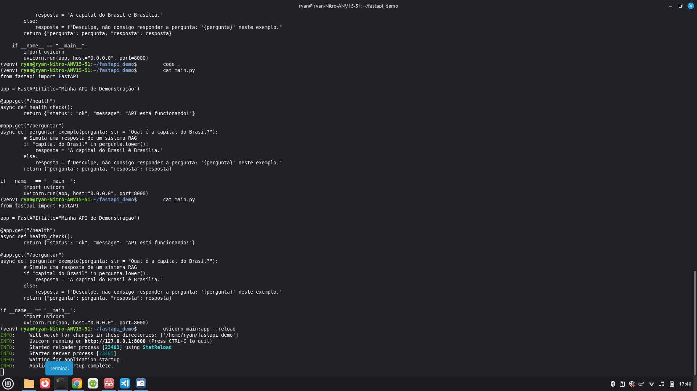
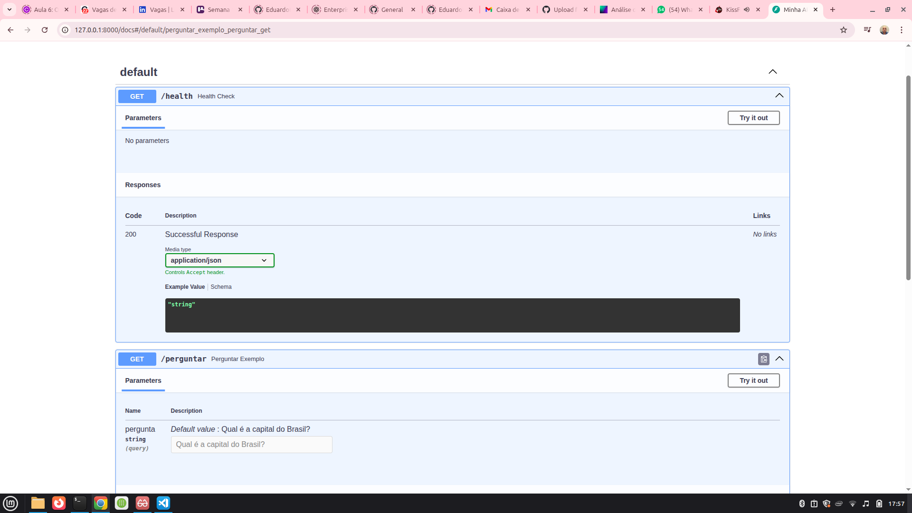

# Sistema de QA para Documentos Jurídicos com RAG e IA Generativa

## Visão Geral do Projeto

Este projeto demonstra a implementação de um **Sistema de Geração Aumentada por Recuperação (RAG)** para extração inteligente e consulta de informações em documentos extensos, com foco em um domínio jurídico. O objetivo é transformar documentos não estruturados em uma base de conhecimento acionável, permitindo que usuários façam perguntas e recebam respostas coerentes e contextualmente relevantes, fundamentadas no conteúdo dos documentos.

A solução visa otimizar a recuperação de informações e a geração de respostas, superando as limitações de modelos de linguagem puramente generativos ao garantir que as respostas sejam baseadas em fontes específicas e verificáveis.

## Arquitetura e Tecnologias

A arquitetura do sistema é modular e utiliza as seguintes tecnologias e frameworks:

*   **Python 3.12:** Linguagem de programação principal para todo o desenvolvimento.
*   **FastAPI:** Framework moderno e de alta performance para construção da API REST, facilitando a interação com o sistema.
*   **Sentence Transformers:** Utilizado para gerar embeddings semânticos de alta qualidade a partir dos chunks de texto dos documentos, permitindo a representação vetorial do conhecimento.
*   **FAISS (Facebook AI Similarity Search):** Biblioteca para busca de similaridade eficiente em espaços vetoriais, crucial para a etapa de recuperação (Retrieval) do RAG.
*   **OpenAI API:** Integrada para o Modelo de Linguagem Grande (LLM) que realiza a etapa de Geração (Generation), formulando respostas coerentes com base no contexto recuperado.
*   **`venv`:** Ambiente virtual para gerenciamento isolado de dependências.
*   **`pypdf`:** Biblioteca para extração de texto de documentos PDF.

## Desafios e Soluções Técnicas

O desenvolvimento deste projeto envolveu a superação de diversos desafios técnicos, demonstrando proficiência em depuração, gerenciamento de dependências e engenharia de software:

1.  **Configuração de Ambiente e Conflitos de Dependência:**
    *   **Desafio:** Garantir a compatibilidade de múltiplas bibliotecas (ex: `numpy`, `pydantic`, `pypdf`, `faiss-cpu`, `openai`) em um ambiente Python 3.12, que frequentemente apresentava conflitos de versão e requisitos.
    *   **Solução:** Utilização estratégica de `venv` para isolamento do ambiente. Investigação aprofundada da documentação de cada biblioteca e uso de `pip install --no-deps` seguido de instalações específicas para resolver conflitos de dependência, garantindo um ambiente estável e funcional.

2.  **Depuração de Erros de Execução da API:**
    *   **Desafio:** Encontrar e resolver erros comuns durante o desenvolvimento da API FastAPI, como `OSError: Address already in use` (conflito de porta) e `TypeError: Client.__init__() got an unexpected keyword argument 'proxies'` (erro na inicialização do cliente OpenAI).
    *   **Solução:** Implementação de rotinas de verificação de porta antes de iniciar o Uvicorn e ajuste da versão da biblioteca `openai` ou da forma de inicialização do cliente para compatibilidade com as versões mais recentes, garantindo a estabilidade e o correto funcionamento da API.

3.  **Validação e Teste da API:**
    *   **Desafio:** Assegurar que todos os endpoints da API funcionassem conforme o esperado e que a integração entre os componentes (carregamento, embeddings, busca, LLM) fosse fluida.
    *   **Solução:** Utilização extensiva da interface **Swagger UI** (gerada automaticamente pelo FastAPI) para testar interativamente as rotas `/health` (para verificar a saúde da API) e `/perguntar` (para validar a funcionalidade de QA), confirmando a correta extração, recuperação e geração de respostas.

## Demonstração Visual

Para ilustrar o funcionamento do sistema, incluímos screenshots da API em execução:

*   
    *   **API em Execução:** Screenshot do terminal mostrando o Uvicorn rodando a aplicação FastAPI, indicando que o serviço está ativo e pronto para receber requisições.
*   
    *   **Swagger UI com Testes:** Screenshot da interface Swagger UI, destacando os testes bem-sucedidos das rotas `/health` (com status 200 OK) e `/perguntar` (mostrando uma requisição de exemplo e a resposta gerada pelo sistema RAG).

## Como Configurar o Ambiente (Código-Fonte Privado)

Embora o código-fonte completo seja proprietário, a configuração do ambiente para um projeto similar seguiria estes passos:

1.  **Clone o repositório:** `git clone https://github.com/ryantepedino/rag-legal-document-qa-system.git`
2.  **Navegue até o diretório:** `cd rag-legal-document-qa-system`
3.  **Crie e ative um ambiente virtual:*
4.   **Instale as dependências:** `pip install -r requirements.txt`
    5.  **Variáveis de Ambiente:** Configure sua chave da OpenAI e outras variáveis de ambiente necessárias (ex: em um arquivo `.env` - não incluído no repositório por segurança).
    6.  **Executar a API:** `uvicorn src.main:app --reload` (Este comando assume a existência do `main.py` e da instância `app` do FastAPI, que não estão publicamente disponíveis aqui).

    ## Considerações sobre o Código

    É importante notar que o código-fonte completo deste projeto é **proprietário e não pode ser compartilhado publicamente** devido a acordos de confidencialidade. No entanto, estou totalmente apto a discutir a arquitetura, os desafios técnicos, as decisões de design e a implementação em detalhes durante entrevistas técnicas.

    ## Contato

    **Ryan Tepedino**
    *   **LinkedIn:** [www.linkedin.com/in/ryan-tepedino-18357a22b](www.linkedin.com/in/ryan-tepedino-18357a22b)
    *   **GitHub:** [https://github.com/ryantepedino](https://github.com/ryantepedino)
    *   **Email:** ryantepedino37@gmail.com
    *   **WhatsApp:** (32) 99141-3852

